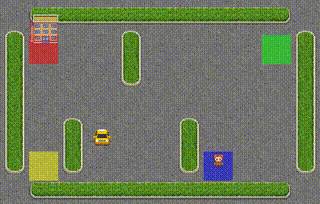

# GridMind 🧠

[](https://github.com/shuvoxcd01/GridMind/actions/workflows/python-publish.yml)

**GridMind** is a library of reinforcement learning (RL) algorithms. This library prioritizes **tabular implementations** to enhance understanding and facilitate hands-on experimentation with learning patterns in various RL algorithms. GridMind is compatible with **`gymnasium` environments**, making it easy to integrate with a wide range of standard RL environments.

This library is also designed to serve as a companion for readers of the book *Reinforcement Learning: An Introduction (2nd ed.)* by Richard S. Sutton and Andrew G. Barto.

> **Note**: GridMind is a work in progress and will be updated with additional algorithms and features over time.

---
<div align="left">
<table style="margin: auto;">
<tr>
<td style="vertical-align: top; padding-right: 10px;">

## 📜 Algorithms Included

### Tabular
#### 1. Monte Carlo Methods
   - **Every-Visit MC**: *Prediction*
   - **Exploring Starts**: *Prediction & Control*
   - **Off-Policy MC**: *Prediction & Control*

#### 2. Temporal Difference (TD) Methods
   - **TD(0)**: *Prediction*
   - **SARSA**: *Control*
   - **Q-Learning**: *Control*

#### 3. N-Step Methods
   - **N_Step TD Prediction**: *Prediction*
   - **N_Step SARSA**: *Control*

### Function Approximation
   - **Semi-gradient TD-0 Prediction**: *Prediction*
   - **Gradient Monte-Carlo Prediction**: *Prediction*
   - **Episodic Semi-gradient SARSA**: *Control*
     

</td>
<td style="vertical-align: top;">

   
*Figure: GridMind on different environments.* 
</td>
</tr>
</table>
</div>

---

## Documentation
[https://gridmind.readthedocs.io/en/latest/](https://gridmind.readthedocs.io/en/latest/)


## Getting Started 🚀

To use GridMind, you’ll need:
- Python (>= 3.8)

1. **Installation**: Clone the repository and install the package with the following commands:
    ```bash
    git clone https://github.com/shuvoxcd01/GridMind.git
    cd GridMind
    pip install .
    ```
    Or, install it from **PyPI**:
    ```bash
    pip install gridmind
    ```

2. **Basic Usage**:  
    ```python
    from gridmind.algorithms.tabular.temporal_difference.control.q_learning import QLearning
    import gymnasium as gym

    # Initialize the Taxi-v3 environment
    env = gym.make("Taxi-v3")
    agent = QLearning(env=env)

    # Train the agent
    agent.optimize_policy(num_episodes=10000)

    # Get the learned policy
    policy = agent.get_policy()

    # Close and re-open the environment for rendering
    env.close()
    env = gym.make("Taxi-v3", render_mode="human")

    # Demonstrate the policy
    obs, _ = env.reset()
    for step in range(100):
        action = policy.get_action_deterministic(state=obs)
        next_obs, reward, terminated, truncated, _ = env.step(action=action)
        print("Reward: ", reward)
        obs = next_obs
        env.render()

        if terminated or truncated:
            obs, _ = env.reset()

    env.close()
    ```


## 🌍 Contribution

Contributions are welcome! Whether it’s bug fixes, new features, or suggestions, feel free to open an issue or submit a pull request. We appreciate the community's input in making GridMind a valuable learning resource for all.
